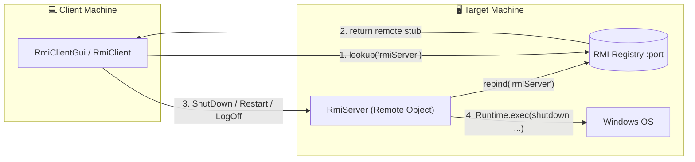
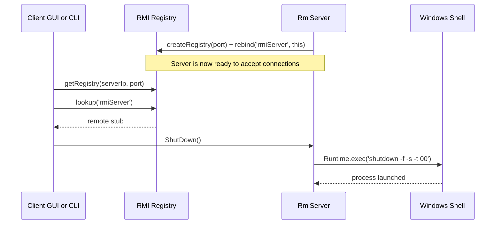

# 🖥️ Remote PC Control with Java RMI

A **client‑server application built on Java RMI (Remote Method Invocation)** that lets one machine
**shut down, restart, or log off** another machine over the network. The server exposes remote
methods; the client looks them up in the RMI registry and invokes them as if they were local calls.
Both a **command‑line** and a **Swing GUI** version are provided.

> ⚠️ **Use responsibly.** This tool triggers real power actions (`shutdown`, `restart`, `log off`)
> on the machine running the server. Only run it on computers you own or are explicitly authorized
> to manage.

---

## ✨ Features

- 🔌 Remote **Shut Down**, **Restart**, and **Log Off** over a network
- 📨 Send arbitrary status messages to the server console
- 🧩 Clean separation via a shared remote interface (`RmiInterface`)
- 🖥️ Two front ends: headless CLI (`RmiClient` / `RmiServer`) and GUI (`RmiClientGui` / `RmiServerGui`)
- 🪟 Executes native Windows commands under the hood (`shutdown -f -s/-r/-l`)

---

## 🏛️ Architecture

Java RMI lets a client invoke methods on an object living in another JVM. The server registers a
remote object in the **RMI registry** under the name `rmiServer`; the client looks it up by the
server's IP + port and receives a **stub** that forwards calls across the network.



### The shared contract — `RmiInterface`

```java
void receiveMessage(String x) throws RemoteException;
void ShutDown() throws Exception;
void Restart() throws Exception;
void LogOff()  throws Exception;
```

Both client and server compile against this interface, guaranteeing they agree on the available
remote operations.

---

## 🔄 Remote Call Sequence



### Command mapping

| Remote method | Windows command | Effect |
|---------------|-----------------|--------|
| `ShutDown()` | `shutdown -f -s -t 00` | Forced shutdown, no delay |
| `Restart()` | `shutdown -f -r -t 00` | Forced restart, no delay |
| `LogOff()` | `shutdown -l -f` | Log off the current user |

---

## 🚀 Getting Started

### Prerequisites
- **JDK 8+**
- Two machines (or two terminals on one machine) on the same network
- Windows on the machine running the **server** (commands are Windows‑specific)

### 1. Compile

```bash
javac -d out src/*.java
```

### 2. Start the server (on the machine to be controlled)

```bash
# CLI version — pass the registry port
java -cp out RmiServer 1099

# ...or launch the GUI, type a port, and click "Start Server"
java -cp out RmiServerGui
```

### 3. Run the client (from the controlling machine)

```bash
# CLI version:  java -cp out RmiClient <serverIp> <port> <S|R|L>
java -cp out RmiClient 192.168.1.10 1099 S   # S = Shut Down, R = Restart, L = Log Off

# ...or launch the GUI, enter IP + port, connect, choose an action, click Apply
java -cp out RmiClientGui
```

---

## 🗂️ Project Structure

```
Distributed-Systems-using-RMI/
├── src/
│   ├── RmiInterface.java   # Shared remote interface (the contract)
│   ├── RmiServer.java      # Remote object: executes shutdown/restart/logoff
│   ├── RmiClient.java      # Command-line client
│   ├── RmiServerGui.java   # Swing server (enter port, Start Server)
│   └── RmiClientGui.java   # Swing client (IP + port, radio buttons, Apply)
└── RMI.iml                 # IntelliJ IDEA module file
```

---

## 🧠 Concepts Demonstrated
- **Java RMI** — registries, `rebind`/`lookup`, remote stubs, `UnicastRemoteObject`
- **Distributed systems** — invoking behavior across JVM/network boundaries
- **`Runtime.exec`** — bridging Java to native OS commands
- **Swing** — building simple client/server front ends

## 💡 Possible Enhancements
- Add authentication so only authorized clients can trigger power actions
- Cross‑platform commands (Linux/macOS shutdown syntax)
- Confirmation dialog + audit log of executed actions
